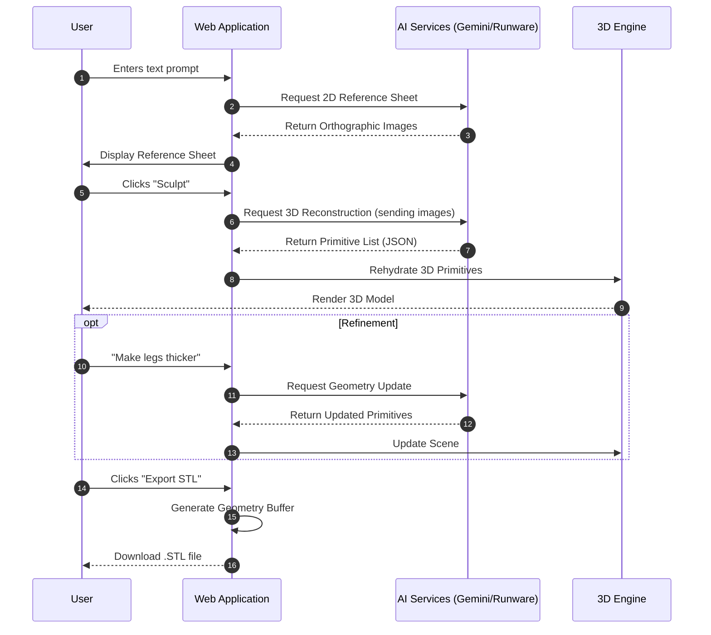

# System Architecture: MakerFlow 3D

## Overview

MakerFlow 3D is a client-side web application designed to bridge the gap between generative AI concept art and physical manufacturing. It acts as a "Neural Sculptor," empowering users to transform textual descriptions or 2D images into 3D printable volumes. By leveraging advanced spatial reasoning capabilities from Large Language Models (LLMs) and real-time 3D rendering, the system provides an intuitive pipeline for creators to iterate on designs and export them for 3D printing.

The primary goal is to democratise 3D modelling by replacing complex CAD workflows with natural language interaction and AI-assisted reconstruction.

## Key Requirements

### Functional
-   **Text-to-3D & Image-to-3D:** capabilities to generate 3D geometry from prompts or reference images using `imagen-3.0` and `gemini-1.5-pro`.
-   **Real-time Visualisation:** Interactive 3D preview with rotation, zoom, wireframe, and material inspection.
-   **Manifold Generation:** Output geometry must be "watertight" and suitable for physical 3D printing.
-   **Export capabilities:** Support for standard 3D file formats (STL, OBJ).
-   **Dual AI Provider Support:** Integration with both Google Gemini models and Runware.ai for diverse generation needs.

### Non-Functional
-   **Client-Side Execution:** The core application logic runs entirely in the user's browser to minimise latency and server costs.
-   **Secured Privacy:** User API keys are stored in `LocalStorage`; no sensitive data is sent to an intermediary backend.
-   **Responsive Design:** The UI must be usable across varying desktop screen sizes.
-   **Performance:** Efficient handling of 3D assets to ensure 60 FPS rendering on standard hardware.

## High-Level Architecture

The system follows a **Client-Side SPA (Single Page Application)** architecture. The browser-based client interacts directly with third-party AI services for compute-intensive tasks (image generation and geometric reasoning) while handling state management, 3D rendering, and file export locally.

```mermaid
graph TD
    User[User] -->|Interacts with| Client[Web Client (React 19)]
    
    subgraph Browser Environment
        Client -->|Manages| State[App State]
        Client -->|Renders| Canvas[3D Canvas (Three.js)]
        Client -->|Stores Keys| LocalStorage[Local Storage]
    end
    
    subgraph External Services
        Client -->|REST/GRPC| Gemini[Google Gemini API]
        Client -->|REST| Runware[Runware.ai API]
    end
    
    Gemini -->|Returns| Geometry[Geometric Data / Primitives]
    Runware -->|Returns| Images[Reference Images]
```

**Diagram Explanation:** The user interacts solely with the React application running in their browser. The application manages its own state and directly coordinates requests to external AI providers (Gemini and Runware). API keys and preferences are persisted in the browser's Local Storage.

## Component Details

### 1. Web Client (Frontend)
-   **Responsibilities:** User interface rendering, input validation, application state orchestration, and managing the 3D scene.
-   **Technologies:** React 19, TypeScript, Vite, Tailwind CSS, Lucide React.
-   **Key Interactions:** 
    -   Captures user prompts via `App.tsx`.
    -   Displays generated reference sheets using standard `` tags.
    -   Provides controls for refining 3D models via the sidebar UI.
    -   Orchestrates the export process (`exportUtils.ts`).

### 2. 3D Engine
-   **Responsibilities:** Real-time rendering of generated geometry, handling user camera controls, material application (PBR), and lighting simulation.
-   **Technologies:** Three.js, React Three Fiber (R3F), React Three Drei.
-   **Key Interactions:**
    -   Receives primitive data from the App State.
    -   Updates the scene graph based on user configuration (e.g., toggle wireframe, change material) via the `<NeuralScene />` component.

### 3. Service Layer (External Integrations)
-   **Responsibilities:** Abstraction of external APIs, error handling, and data transformation.
    -   **Gemini Service (`geminiService.ts`):** Handles geometric reasoning ("Neural Sculpting") using `gemini-1.5-pro` and image generation using `imagen-3.0`.
    -   **Runware Service (`runwareService.ts`):** Provides high-speed image generation for reference blueprints via `runware:100@1`.
-   **Communication:** HTTPS requests (REST/gRPC depending on the SDK).

### 4. Persistence
-   **Responsibilities:** Saving user configuration between sessions.
-   **Technologies:** Browser `LocalStorage`.
-   **Data Stored:** API Keys (`VITE_GEMINI_API_KEY` overrides), preferred image provider (`GEMINI` or `RUNWARE`), recent UI settings.

## Data Flow

### Workflow: Concept to Print
This flow describes the core specific user journey from an idea to a downloadable file.



## Data Model (High-Level)

Since the application is stateless on the server side, the data model exists transiently in memory.

-   **ModelData:** The core entity representing a 3D object.
    -   `name`: String
    -   `primitives`: Array of `Primitive3D` (Box, Sphere, Capsule, Cylinders)
    -   `metadata`: Generation parameters (creation time, source prompt)

-   **Primitive3D:** A single geometric volume.
    -   `type`: Enum ('BOX', 'SPHERE', 'CAPSULE', 'CYLINDER')
    -   `position`: Vector3 [x, y, z]
    -   `rotation`: Euler [x, y, z] in radians
    -   `scale`: Vector3 [x, y, z]
    -   `color`: Hex string

-   **ReferenceSheet:**
    -   `imageUrl`: URL (Blob or External)
    -   `prompt`: String used to generate it.

## Infrastructure & Deployment

-   **Hosting:** The application is a static site that can be deployed to any static hosting provider (e.g., GitHub Pages, Vercel, Netlify).
-   **Build Process:** `npm run build` produces optimised HTML/CSS/JS assets via Vite.
-   **Environments:**
    -   **Local:** Runs on `localhost:5173` via Vite, utilizing locally stored keys or env vars.
    -   **Production:** Deployed static assets; purely client-side execution.

## Scalability & Reliability

-   **Client-Side Load:** By offloading rendering and state to the client, the hosting infrastructure load is negligible. Scalability is strictly limited by the external AI API rate limits (Google Cloud quotas / Runware credits).
-   **API Reliability:** The application implements `try/catch` wrappers in service calls to handle API failures (e.g., quotas exceeded, invalid keys) and display user-friendly error messages in the UI.
-   **Browser Performance:** Use of efficient WebGL wrappers (R3F) ensures reliability across modern browsers. Complex models with many primitives may impact frame rates on lower-end devices.

## Security & Compliance

-   **Data Privacy:** 
    -   Local-first architecture ensures user prompts and generated models do not transit through a proprietary backend logging system.
    -   API keys are stored in `LocalStorage`, meaning they never leave the user's specific browser instance except to authenticate requests directly to the provider.
-   **Content Safety:** External AI providers (Google, Runware) implement their own safety filters for generated imagery and text.

## Observability

-   **Console Logging:** Standard browser console logs are used for debugging during development.
-   **Error Boundaries:** React Error Boundaries capture UI crashes to prevent white-screen failures.
-   *(Note: As a purely client-side app, centralised logging is not currently implemented to respect user privacy.)*

## Trade-offs & Decisions

-   **Client-Side vs. Server-Side:** 
    -   *Decision:* Client-side only.
    -   *Reason:* Reduces hosting complexity and cost to zero. Maximises privacy.
    -   *Trade-off:* Cannot easily share models between users or implement long-running background jobs without keeping the tab open.
-   **Three.js vs. Spline/Other 3D libs:**
    -   *Decision:* Three.js / React Three Fiber.
    -   *Reason:* Mature ecosystem, open-source, and fine-grained control over geometry construction (essential for the primitive-based reconstruction).
-   **Primitive-based Reconstruction:**
    -   *Decision:* Generating composition of primitives rather than raw meshes.
    -   *Reason:* Easier for LLMs to reason about abstract forms (e.g. "place a box at X") than generating thousands of vertex coordinates. Easier to ensure manifold/printable outputs.

## Future Improvements

-   **Mesh Export formats:** Support for `.gltf` and `.ply`.
-   **Backend Sync:** Optional Supabase integration for saving user galleries and sharing models.
-   **Advanced Sculpting Tools:** Gizmo-based manual manipulation of generated primitives (move/scale/rotate) to fine-tune AI results.
-   **Local LLM Support:** Integration with WebLLM to run smaller quantised models directly in the browser for zero-latency, offline-capable refinement.
