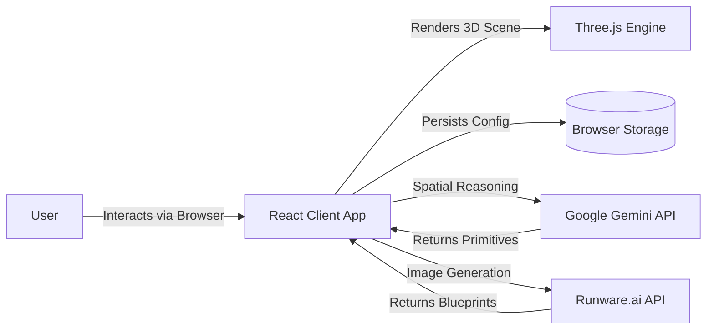

# MakerFlow 3D
> Neural Sculptor: Bridging the gap between AI concepts and physical manufacturing.


MakerFlow 3D is a client-side web application designed to act as a "Neural Sculptor," empowering users to transform textual descriptions or 2D images into manifold, 3D printable volumes. By leveraging advanced spatial reasoning capabilities from Large Language Models (LLMs) and real-time 3D rendering, the system democratises the 3D modelling process, replacing complex CAD workflows with intuitive natural language interaction. Ideal for makers, 3D printing enthusiasts, and concept designers who want to bring AI-generated ideas into the physical world.

## Table of Contents
- [Features](#features)
- [Tech Stack](#tech-stack)
- [Architecture Overview](#architecture-overview)
- [Installation](#installation)
- [Usage](#usage)
- [Configuration](#configuration)
- [Screenshots](#screenshots)
- [API Reference](#api-reference)
- [Tests](#tests)
- [Roadmap](#roadmap)
- [Contributing](#contributing)
- [License](#license)
- [Contact](#contact)

## Features
-   **Text-to-3D Reconstruction**: Convert descriptive prompts into 3D geometric compositions using Gemini 3 Pro.
-   **Image-to-3D Workflow**: Upload or generate 2D reference sheets and transform them into 3D volumes.
-   **Dual AI Provider Support**: Seamlessly switch between Google Gemini (reasoning) and Runware.ai (high-speed image generation).
-   **Real-time 3D Workbench**: Interactive canvas with orbit controls, wireframe toggle, and blueprint overlays.
-   **Manufacturing Optimized**: Generates manifold geometry ready for slicing ("watertight" models).
-   **Export Capabilities**: One-click export to `.STL` (for printing) and `.OBJ` (for digital use).
-   **Natural Language Refinement**: modify your model with commands like "make the base wider" or "add antenna".
-   **Privacy-First Design**: API keys are stored in your browser's local storage; no intermediate backend server.

## Tech Stack
-   **Frontend Framework**: React 19
-   **Language**: TypeScript
-   **Build Tool**: Vite
-   **Styling**: Tailwind CSS
-   **3D Engine**: Three.js, React Three Fiber (R3F), React Three Drei
-   **AI Integration**: Google Gemini API, Runware.ai API
-   **Icons**: Lucide React

## Architecture Overview

The system operates as a **Client-Side Single Page Application (SPA)**. The browser handles all application state, rendering, and API orchestration, communicating directly with third-party AI services.



**Component Interaction**:
1.  **React Client App**: Manages the UI, user inputs, and application logic.
2.  **Three.js Engine**: Renders the generated primitives in real-time.
3.  **External APIs**: Perform heavy lifting—Gemini for geometric logic and Runware for visual references.
4.  **Local Storage**: Saves API keys and user preferences securely on the client machine.

## Installation

### Prerequisites
-   **Node.js** (v18 or higher recommended)
-   **npm** or **yarn**
-   **Git**

### Steps
1.  Clone the repository:
    ```bash
    git clone https://github.com/MasteraSnackin/MakerFlow-3D.git
    cd MakerFlow-3D
    ```

2.  Install dependencies:
    ```bash
    npm install
    ```

## Usage

### Running Locally
To start the development server:

```bash
npm run dev
```

Open your browser and navigate to `http://localhost:5173/`.

### First Run
1.  **Configure API Keys**: Click the "Connect Google" button or the Key icon in the top right corner.
2.  **Enter Keys**: You can either sign in with Google (if using Project IDX) or manually enter your **Google Gemini API Key** and optional **Runware API Key** in the settings.
3.  **Start Creating**: Enter a prompt describing your object (e.g., "A retro-futuristic toaster") and click "Start Neural Pipeline".

### Exporting
Once satisfied with your model, use the "Export" buttons in the top right to download an `.STL` file ready for your 3D printer software (Cura, PrusaSlicer, etc.).

## Configuration

This project is a client-side app, so configuration is handled via the UI Settings modal or `.env` files for development convenience.

**Environment Variables (Optional for Dev):**
Create a `.env.local` file in the root directory to pre-load keys (not recommended for shared machines).
```env
VITE_GEMINI_API_KEY=your_key_here
VITE_RUNWARE_API_KEY=your_key_here
```

## Screenshots
### Blueprint Generation


*Four-view orthographic blueprint generated from text prompt, showing front, back, left, and right views with artistic style selection.*

### 3D Workbench - Wireframe View


*Interactive 3D workbench displaying wireframe mesh with blueprint overlay and clipping tools for precise geometry inspection.*

### 3D Workbench - Solid Render


*Fully rendered 3D model with texture maps and lighting, ready for export to STL format.*


*Alternative angle showing the neural sculpt output with manufacturing-optimized geometry.*
## API Reference
This project consumes external APIs. It does not provide its own public API.
-   **Google Gemini API**: Used for `generateContent` with multimodal prompts.
-   **Runware.ai API**: Used for `imageInference` to generate orthographic blueprints.

## Tests
Currently, the project relies on TypeScript for static type checking and compile-time validation.
To run the build check:

```bash
npm run build
```

*(Future roadmap includes adding Vitest for unit testing utility functions called `reconstruct3DVolume`).*

## Roadmap
-   [ ] Add comprehensive unit tests with Vitest.
-   [ ] Implement GLTF/GLB export support.
-   [ ] Add local history/gallery to save previous generations.
-   [ ] Integrate WebLLM for offline, local-only inference options.

## Contributing
Contributions are welcome! Please follow these steps:
1.  Fork the repository.
2.  Create a feature branch (`git checkout -b feature/AmazingFeature`).
3.  Commit your changes (`git commit -m 'Add some AmazingFeature'`).
4.  Push to the branch (`git push origin feature/AmazingFeature`).
5.  Open a Pull Request.

## License
Distributed under the **MIT License**. See `LICENSE` for more information.

## Contact
**MasteraSnackin**  
Project Link: [https://github.com/MasteraSnackin/MakerFlow-3D](https://github.com/MasteraSnackin/MakerFlow-3D)
